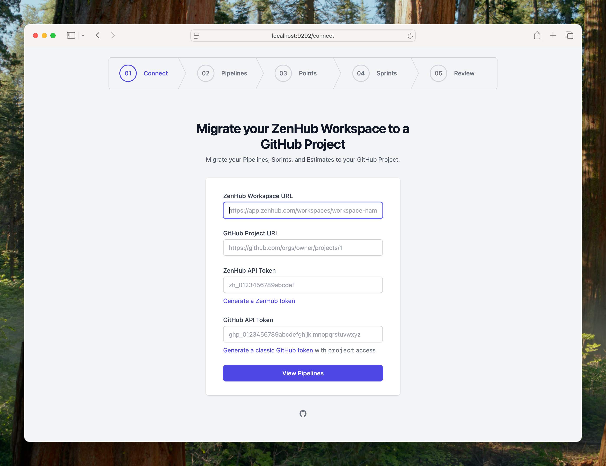
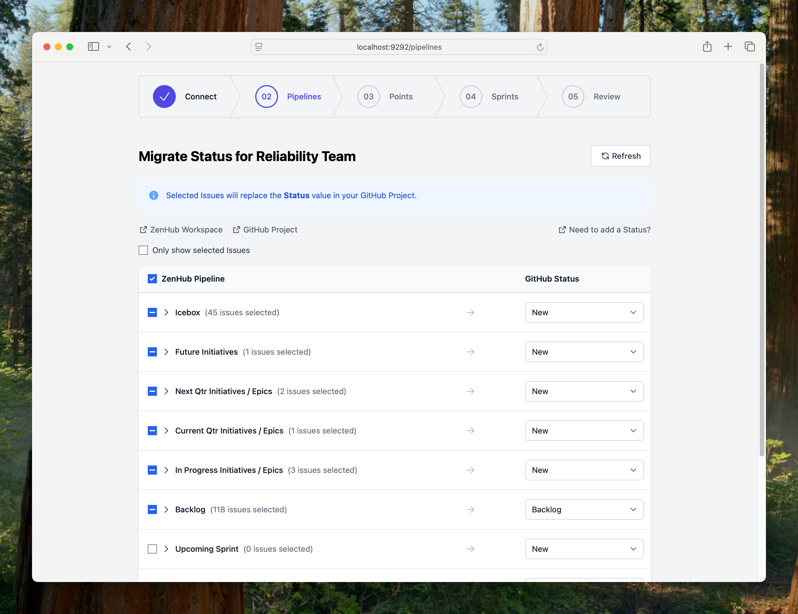
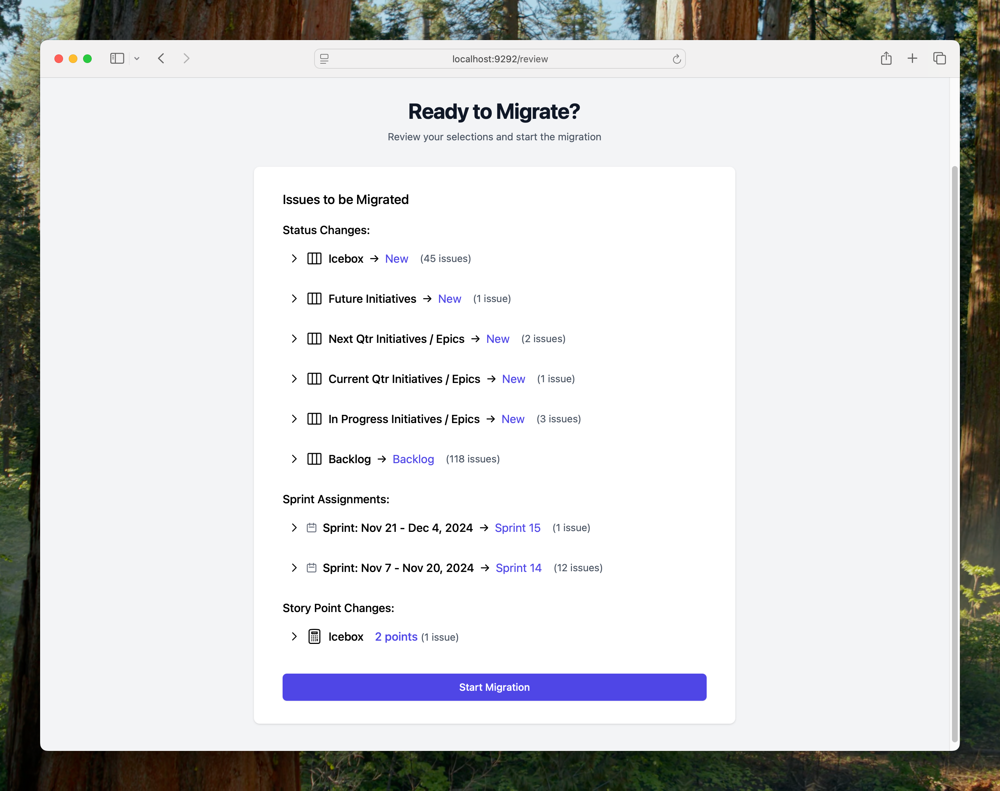

# z2g - a tool to aid in migrating from ZenHub Workspaces to GitHub Projects

## Running locally

1. Set a `SESSION_SECRET` environment variable (needs to be >64 characters)
2. Install gems: `bundle install`
3. Run the server: `bundle exec rackup`
4. Visit http://localhost:9292
